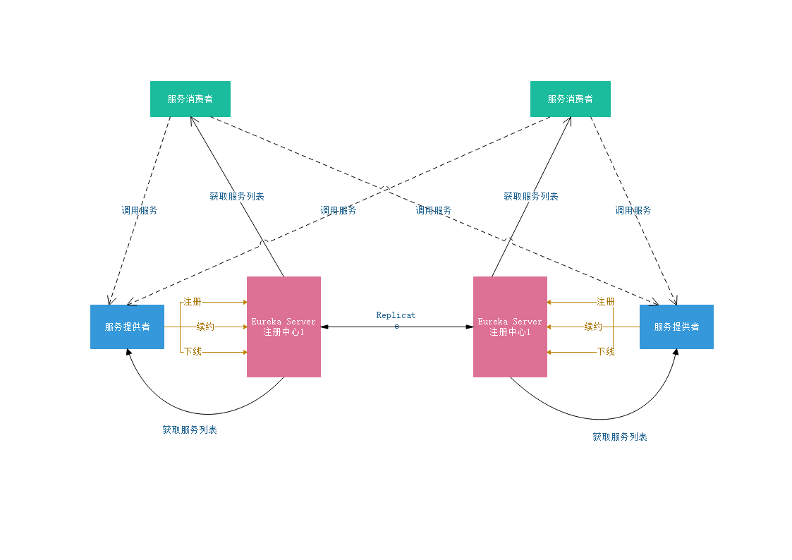

1. eureka
    
        实现将服务提供者注册到注册中心，支持服务注册发现机制。
        
        eureka server 提供注册中心服务（单点或者高可用集群模式）
        eureka client 将服务提供者注册到注册中心
        
2. eureka服务注册发现治理体系

    

    如图：
        
        两个EurekaServer相互注册构成高可用集群注册中心。
        服务提供启动两个实例，一个注册到注册中心1，一个注册到注册中心2上。
        两个消费者分别指向一个注册中心。
        
        

    eureka服务治理机制：
    
    1. 服务提供者
        1.1 服务注册
            服务提供者在服务启动时会通过发送REST请求方式将自己注册到Eureka Server上，同时带上服务自身元数据信息。
            Eureka Server接收到REST请求之后，将元数据信息存储到一个双层结构Map中，其中第一层的key是服务名，
            第二层key是具体的实例名
            在服务注册时，需要确认eureka.client.register-with-eureka=true,默认设置为true，false将不会注册到注册中心。
        1.2 服务同步
            两个服务分别被注册到不同注册中心上，但是服务会被两个注册中心所维护，由于服务注册中心之间互相注册为服务，
            当服务提供者发送注册请求到服务注册中心时，它会将请求转发给集群中相连的其它注册中心，从而实现注册中心之间
            服务的同步。
        1.3 服务续约
            在注册服务之后，服务提供者会维护心跳持续告诉服务注册中心（Eureka Server）“我还活着”，以防止注册中心的
            “剔除任务”将服务提供者从注册中心列表中删除
            
            服务续约两个主要属性配置
            # 服务续约任务调用间隔 默认30秒
            eureka.instance.lease-renewal-interval-in-seconds=30
            # 服务续约时效时间 默认90秒
            eureka.instance.lease-expiration-duration-in-seconds=90
    2. 服务消费者
        2.1 获取服务
            消费者服务定时发送REST请求到注册中心获取注册中心在册的服务提供者清单列表，出于性能考虑Eureka Server会维护一份
            只读的服务清单列表返回给客户端，同时该缓存清单每隔30秒更新一次。
            
            主要属性配置
            # 消费者服务获取服务提供者清单列表，false不获取
            eureka.client.fetch-registry=true
            # 消费者更新缓存服务清单列表时间 默认30秒
            eureka.client.registry-fetch-interval-seconds=30
        2.2 服务调用
            服务消费者获取服务清单后，通过服务名获取服务实例和该实例元数据信息，消费者根据自己需求决定具体调用哪个实例，
            在Ribbon中采用轮询方式进行调用，从而实现消费者客户端负载均衡。
        2.3 服务下线
            服务正常下线时会触发服务下线的REST请求给注册中心，告诉注册中心“我要下线了”。服务端在接收到该请求后将服务状态
            置为下线（DOWN），并把下线事件传播出去。
    3. 服务注册中心
        3.1 失效剔除
            服务实例有时会出现非正常下线（内存溢出，网络故障等缘故），而服务注册中心未收到下线REST请求，为了将这些非正常下线
            的服务实例剔除，Eureka Server在启动时会创建一个定时任务，每隔一段时间（默认60秒）将当前清单中超时（默认90秒）
            没有进行续约的服务进行剔除。
        3.2 自我保护
            服务注册到Eureka Server之后，会维护一个心跳连接，告诉Eureka Server自己还活着。Eureka Server在运行期间，会统计
            心跳失败的比例在15分钟之内是否低于85%，如果出现低于的情况，Eureka Server会将当前的实例注册信息保护起来，让这些实例
            不会过期，尽可能保护这些注册信息。但是，这段保护期内实例若出现问题 ，客户端容易获取到不可用的服务实例，会出现失败的情况，
            所以客户端必须要有容错机制，如：请求重试、短路由器等机制。
            
            配置：
            # true：开启保护机制、false：关闭保护机制
            eureka.server.enable-self-preservation=true