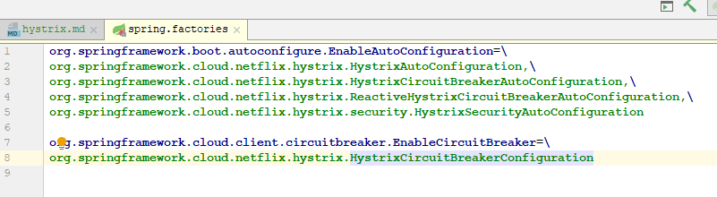

1. Hystrix 说明

        ● 雪崩效应常见场景
            硬件故障：如服务器宕机，机房断电，光纤被挖断等。
            流量激增：如异常流量，重试加大流量等。
            缓存穿透：一般发生在应用重启，所有缓存失效时，以及短时间内大量缓存失效时。大量的缓存不命中，使请求直击后端服务，造成服务提供者超负荷运行，引起服务不可用。
            程序BUG：如程序逻辑导致内存泄漏，JVM长时间FullGC等。
            同步等待：服务间采用同步调用模式，同步等待造成的资源耗尽。
            
        ● 雪崩效应应对策略
            针对造成雪崩效应的不同场景，可以使用不同的应对策略，没有一种通用所有场景的策略，参考如下：
            硬件故障：多机房容灾、异地多活等。
            流量激增：服务自动扩容、流量控制（限流、关闭重试）等。
            缓存穿透：缓存预加载、缓存异步加载等。
            程序BUG：修改程序bug、及时释放资源等。
            同步等待：资源隔离、MQ解耦、不可用服务调用快速失败等。资源隔离通常指不同服务调用采用不同的线程池；不可用服务调用快速失败一般通过熔断器模式结合超时机制实现。
            
        综上所述，如果一个应用不能对来自依赖的故障进行隔离，那该应用本身就处在被拖垮的风险中。 
        因此，为了构建稳定、可靠的分布式系统，我们的服务应当具有自我保护能力，当依赖服务不可用时，
        当前服务启动自我保护功能，从而避免发生雪崩效应。本文将重点介绍使用Hystrix解决同步等待的雪崩问题。
        
        Hystrix 功能：
        □ 在通过第三方客户端访问（网络）依赖服务出现高延迟或者失败时，为系统提供保护和控制。
        □ 复杂分布式系统中防止级联失败（服务雪崩效应）。
        □ 快速失败（Fail Fast）同时能快速修复。
        □ 提供失败回滚（FallBack）和优雅的服务降级机制。
        □ 提供近实时的监控、报警和运维控制手段。
        
2. Hystrix应用
    
    Hystrix 结合 
        eureka（分布式注册中心、提供服务注册发现管理）
        ribbon（客户端负载均衡管理器）
        restTemplate（rest请求模板api）
        

    引用jar
    eureka：（2.2.3版本eureka已经关联引用ribbon相关依赖）
    <dependency>
                <groupId>org.springframework.cloud</groupId>
                <artifactId>spring-cloud-starter-netflix-eureka-server</artifactId>
    </dependency>        
    Hystrix：
    <dependency>
                <groupId>org.springframework.cloud</groupId>
                <artifactId>spring-cloud-starter-netflix-hystrix</artifactId>
    </dependency>

    启动入口添加注解：
    @EnableCircuitBreaker ，开启熔断器
    
    在需要调用方法业务上添加熔断机制：
    @HystrixCommand(fallbackMethod = "indexFallBack")
    
    
3. 源码分析
    
        第一步：SpringBoot启动加载Hystrix依赖包下 SPI 配置
     
        
        核心：aop 环绕增强模式，在执行调用前后增加熔断器机制。
        
        主要加载：
        org.springframework.cloud.netflix.hystrix.HystrixCircuitBreakerConfiguration
        注入spring 容器
        HystrixCommandAspect
        此AOP注解主要实现对@HystrixCommand注解进行拦截。
        部分代码如下：
        @Pointcut("@annotation(com.netflix.hystrix.contrib.javanica.annotation.HystrixCommand)")
        
            public void hystrixCommandAnnotationPointcut() {
        }
        
        @Pointcut("@annotation(com.netflix.hystrix.contrib.javanica.annotation.HystrixCollapser)")
        public void hystrixCollapserAnnotationPointcut() {
        }
        
        采用@Around环绕切面模式
        public Object methodsAnnotatedWithHystrixCommand(final ProceedingJoinPoint joinPoint) throws Throwable {
                // 获取增强方法名
                Method method = getMethodFromTarget(joinPoint);
                Validate.notNull(method, "failed to get method from joinPoint: %s", joinPoint);
                // 验证注解是否满足HystrixCommand or HyStrixCollapser
                if (method.isAnnotationPresent(HystrixCommand.class) && method.isAnnotationPresent(HystrixCollapser.class)) {
                    throw new IllegalStateException("method cannot be annotated with HystrixCommand and HystrixCollapser " +
                            "annotations at the same time");
                }
                // 根据方法注解得到元参数操作工厂对象
                MetaHolderFactory metaHolderFactory = META_HOLDER_FACTORY_MAP.get(HystrixPointcutType.of(method));
                // 创建执行命令元参数持有对象
                MetaHolder metaHolder = metaHolderFactory.create(joinPoint);
                // 命令执行 -- 封装CommandAction
                HystrixInvokable invokable = HystrixCommandFactory.getInstance().create(metaHolder);
                // 执行类型  同步、异步、观察者模式
                ExecutionType executionType = metaHolder.isCollapserAnnotationPresent() ?
                        metaHolder.getCollapserExecutionType() : metaHolder.getExecutionType();
                
                Object result;
                try {
                    if (!metaHolder.isObservable()) {
                        // 指定command命令
                        result = CommandExecutor.execute(invokable, executionType, metaHolder);
                    } else {
                        
                        result = executeObservable(invokable, executionType, metaHolder);
                    }
                } catch (HystrixBadRequestException e) {
                    throw e.getCause();
                } catch (HystrixRuntimeException e) {
                    throw hystrixRuntimeExceptionToThrowable(metaHolder, e);
                }
                return result;
            }
        
        
            内部流程实现通过RxJava  观察者-订阅者模式实现（响应式编程）
            其中源码中Observable对象是RxJava中的核心内容之一，可以理解为“事件源”或是“被观察者”，与其对应的Subscriber对象，可以理解为
            “订阅者”或是“观察者。这两个对象是Rxjava响应式变成重要组成部分。
            ● Observable用来向订阅者Subscribe对象发布时间，Subscriber对象则在接收到事件后对其进行处理，而在Hystrix源码中事件就是对
            依赖服务的调用。
            ● 一个Observable可以发出多个事件，直到结束或者发生异常。
            ● Observable对象每发出一个时间，就会调用对应观察者Subscriber对象onNext()方法。
            ● 每一个Observable的执行，最后一定会通过调用Subscriber.onCompleted()或者Subscriber.onError()来结束该实现的操作流。
            
            关于RxJava简单示例
            /**
                 * 创建事件源
                 */
                static Observable<String> observable = Observable.create(new Observable.OnSubscribe<String>() {
                    @Override
                    public void call(Subscriber<? super String> subscriber) {
                        subscriber.onNext("Hello RxJava");
                        subscriber.onNext("command rxJava");
                        subscriber.onCompleted();
                    }
                });
            
                /**
                 * 订阅者
                 */
                static Subscriber<String> subscriber = new Subscriber<String>() {
                    @Override
                    public void onCompleted() {
            
                    }
            
                    @Override
                    public void onError(Throwable e) {
            
                    }
            
                    @Override
                    public void onNext(String s) {
                        System.out.println("Subscribe : " + s);
                    }
                };
            
                public static void main(String[] args) {
                    // 订阅
                    observable.subscribe(subscriber);
                }
        
        
        Hystrix熔断器核心：HystrixCommand 和 HystrixObservableCommand 
        
        核心断路器：HystrixCircuitBreaker
        
        
        
4. Hystrix dashboard
    Hystrix 仪表盘监控
    
    在Spring Cloud 2.2.x版本 在监控页面显示存在js调用bug，由于2.2.x版本使用jquery版本3.4.1
    在spring-cloud-netflix-hystrix-dashboard-2.2.3.RELEASE 包中templates\hystrix\monitor.ftlh
    修改$(window).load(function() 为 $(window).on("load",function()
    
        
        
        
        
        
        
        
        
        
        
        
        
        
        